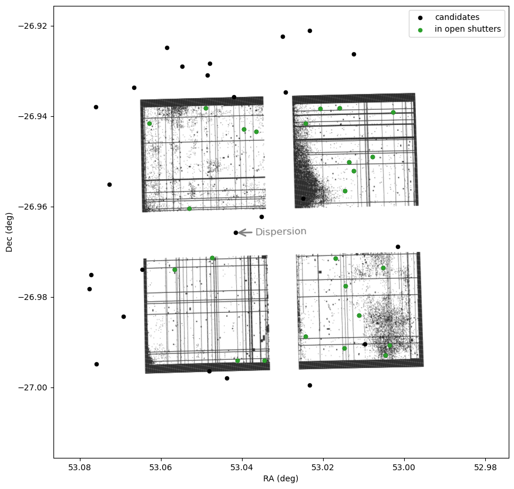

Purpose
-------

This package optimizes JWST/NIRSpec MSA configurations (RA, Dec, PA) to maximize the number of sources placed within shutters. 

This package is based on [eMPT](https://github.com/esdc-esac-esa-int/eMPT_v1) reimplemented in Python. We have several extensions:

1. Flexiable in-shutter criteria. We have two options: a) source centering options as in MPT; b) an in-shutter flux threshold that accounts for the PSF and source fluxes.
2. Optimize top solutions of grid search using a differential evolution algorithm.
3. A flexible criterion for handling shutter conflicts.

Example
-------
```py
from msa_planner import *
np.random.seed(42)
N = 50

ra, dec = 53 + np.random.rand(N)*0.08, -27 + np.random.rand(N)*0.08
msa_model = MSAModel('esa_msa_map_APT_2025.5.3.dat', './msa_v2v3.dat',
                     ra_sources=ra, dec_sources=dec, flux_sources=None,
                     radius_source=0.06, flux_threshold=0.5, buffer=UNCONSTRAINED)

# Optimize
optimizer = MSAOptimizer(msa_model)
results = optimizer.grid_search(53, -27, 30, 
                                dra = 0.05, ddec = 0.05, dpa = 30,
                                n_steps=(50,50,50))
print(f'Maximum objects in open shutters: {np.max(results["score"])}/{len(ra)}')

optimized_results = optimizer.optimize_top_solutions(results, n_top=10, maxiter=300)
print(f'Maximum objects in open shutters: {optimized_results["score"][0]}/{len(ra)}')

show_msa_result(msa_model, optimized_results['ra'][0], optimized_results['dec'][0], optimized_results['pa'][0])
```


Authors
-------
Daniel Eisenstein, Samuel McCarty, Zihao Wu (listed alphabetically)
