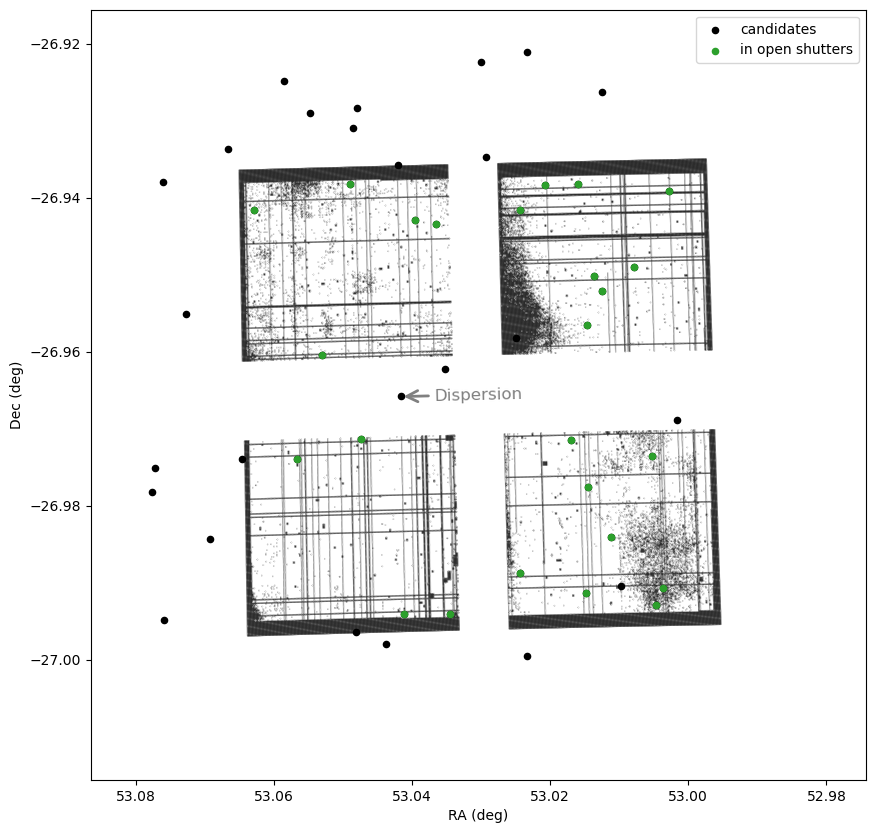

# hMPT: High-performance MSA Planning Tool

Purpose
-------

This package optimizes JWST/NIRSpec MSA configurations (RA, Dec, PA) to maximize the number of sources placed within shutters. 

Highlighted features:

1. Allow for optimizing MSA position angles.
2. Further optimize near local maximum solutions of grid search, which greatly improves the performance.
3. Use in-shutter flux thresholds, so fainter sources are preferencially placed on the shutter center to enhance the throughtput.
4. A flexible criterion for handling shutter conflicts.

The sky-to-shutter projection algorithm is based on [eMPT](https://github.com/esdc-esac-esa-int/eMPT_v1).

Example
-------
```py
from msa_planner import *
np.random.seed(42)
N = 50

ra, dec = 53 + np.random.rand(N)*0.08, -27 + np.random.rand(N)*0.08
msa_model = MSAModel('esa_msa_map_APT_2025.5.3.dat', './msa_v2v3.dat',
                     ra_sources=ra, dec_sources=dec, flux_sources=None,
                     radius_source=0.06, flux_threshold=0.5, buffer=UNCONSTRAINED)

# Optimize
optimizer = MSAOptimizer(msa_model)
results = optimizer.grid_search(53, -27, 30, 
                                dra = 0.05, ddec = 0.05, dpa = 30,
                                n_steps=(50,50,50))
print(f'Maximum objects in open shutters: {np.max(results["score"])}/{len(ra)}')

optimized_results = optimizer.optimize_top_solutions(results, n_top=10, maxiter=300)
print(f'Maximum objects in open shutters: {optimized_results["score"][0]}/{len(ra)}')

show_msa_result(msa_model, optimized_results['ra'][0], optimized_results['dec'][0], optimized_results['pa'][0])
```


Authors
-------
Daniel Eisenstein, Samuel McCarty, Zihao Wu (listed alphabetically)
